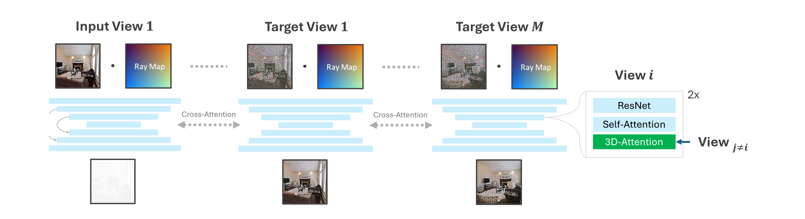

# Multi-View Latent Diffusion Model (MV-LDM)

We propose an open-source multi-view diffusion model trained on RealEstate-10K dataset. The architecture follows similar structure as in [CAT3D](https://cat3d.github.io/).



[](https://arxiv.org/abs/2403.16292)

This is an extension of the codebase for 

**MET3R: Measuring Multi-View Consistency in Generated Images** \
*Mohammad Asim, Christopher Wewer, Thomas Wimmer, Bernt Schiele, and Jan Eric Lenssen*

Check out the [project website here](https://geometric-rl.mpi-inf.mpg.de/met3r/).


## Installation

To get started, create a conda environment:

```bash

conda create -n diffsplat python=3.10
conda activate diffsplat

pip install torch==2.4.1 torchvision==0.19.1 torchaudio==2.4.1 --index-url https://download.pytorch.org/whl/cu118

pip install -r requirements.txt

```

## Acquiring Datasets
Please move all dataset directories into a newly created `datasets` folder in the project root directory or modify the root path as part of the dataset config files in `config/dataset`.

### RealEstate10k
For experiments on RealEstate10k, we use the same dataset version and preprocessing into chunks as pixelSplat. Please refer to their codebase [here](https://github.com/dcharatan/pixelsplat#acquiring-datasets) for information about how to obtain the data.

## Acquiring Pre-trained Checkpoints

Trained checkpoint of **MV-LDM** for RealEstate10k are available on Hugging Face at [asimbluemoon/mvldm-1.0](https://huggingface.co/asimbluemoon/mvldm-1.0/tree/main).

## Running the Code

### Sampling RealEstate-10K Scenes

The main entry point is `src/scripts/generate_mvldm.py`. Call it via:

> [!IMPORTANT] 
> Sampling requires a GPU with at least 16 GB of VRAM.

```bash
python -m src.scripts.generate_mvldm +experiment=baseline mode=test dataset.root="<root-path-to-re10k-dataset>" scene_id="<scene-id>" checkpointing.load="<path-to-checkpoint>" dataset/view_sampler=evaluation dataset.view_sampler.index_path=assets/evaluation_index/re10k_video.json test.sampling_mode=anchored test.num_anchors_views=4 test.output_dir=./outputs/mvldm 
```

> [!NOTE]
> ```scene_id="<scene-id>"``` either defines the specific integer index which refers to an ID of a scene ordered as in ```assets/evaluation_index/re10k_video.json``` or the sequence ID as a string e.g. ```"2d3f982ada31489c"```.
> ```python
> scene_id=25
> scene_id="2d3f982ada31489c"
> ```
> To limit the number of frames in a given sequence, add the ```test.limit_frames``` argument to the above command as integer, e.g.,
> ```python
> test.limit_frames=80
> ```
> To define DDIM sampling steps, use the argument ```model.scheduler.num_inference_steps```, e.g.,
> ```python
> model.scheduler.num_inference_steps=25
> ```
### Training MV-LDM
Our code supports multi-GPU training. The above batch size is the per-GPU batch size.

> [!IMPORTANT] 
> Training requires a GPU with at least 40 GB of VRAM.


```bash
python -m src.main +experiment=baseline
  mode=train
  dataset.root="<root-path-to-re10k-dataset>"
  hydra.run.dir="<runtime-dir>"
  hydra.job.name=train
```
> [!WARNING] 
> In case of memory issues during training, we recommend lowering the batch size by appending ```data_loader.train.batch_size="<batch-size>"``` to the above command. 

For running the training as a job chain on slurm or resuming training, always set the correct path in ```hydra.run.dir="<runtime-dir>"``` for each task.


## BibTeX
If you are planning to use MV-LDM in your work, consider citing it as follows.
<section class="section" id="BibTeX">
  <div class="container is-max-desktop content">
    <pre><code>@inproceedings{asim25met3r,
    title = {MEt3R: Measuring Multi-View Consistency in Generated Images},
    author = {Asim, Mohammad and Wewer, Christopher and Wimmer, Thomas and Schiele, Bernt and Lenssen, Jan Eric},
    booktitle = {IEEE/CVF Computer Vision and Pattern Recognition ({CVPR})},
    year = {2025},
}</code></pre>
  </div>
</section>


